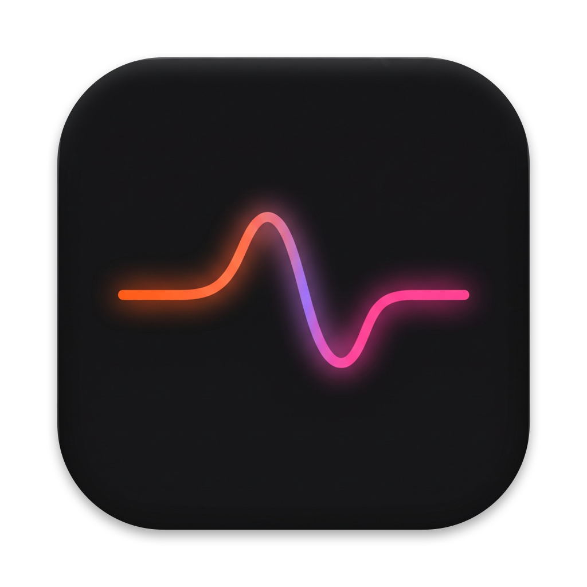

<p align="center">
  
</p>

<h1 align="center">Utter</h1>

<p align="center"><b>Private voice control for your Mac.</b><br/>
Say what you want in plain words. A small AI model running on your Mac turns it into actions.</p>

<p align="center">
  
  
  
</p>

---

Press **⌘⇧Space**, speak, and Utter does it:

| You say | Utter does |
|---|---|
| “Could you pull up Chrome” | Opens any installed app |
| “Open WhatsApp and then Calculator” | Runs several steps in order |
| “Write hello in notes” · “Open Notes and write buy milk” · “Jot down call the plumber” | Creates the note with your exact words |
| “Remind me to call mum at 5” · “Remind me tomorrow morning at 9” · “Remind me in 20 minutes” | Adds a reminder with an alert. Times are worked out in code: “at 5” means the next 5 o’clock, and a time that has already passed moves to tomorrow |
| “Run my Water Eject shortcut” | Runs one of your Apple Shortcuts |
| “Search for pasta recipes” · “Go to youtube.com” | Opens it in your browser |
| “Set volume to 30” · “Mute” | Changes the volume |
| “Open Safari… actually Chrome” | Acts on what you meant |

Everything runs **on your Mac**. The language model is served by [Ollama](https://ollama.com), and speech recognition uses Apple's on-device recognizer only. If a Mac can't recognise speech on-device, Utter won't listen (typed commands still work). There is no account, no API key and no cloud service.

## Requirements

- macOS 14 Sonoma or later, Apple Silicon recommended
- Xcode Command Line Tools: `xcode-select --install`
- [Ollama](https://ollama.com) with the `qwen3:4b-instruct` model (about 2.5 GB)

## Install

```sh
brew install ollama
brew services start ollama
ollama pull qwen3:4b-instruct

git clone https://github.com/Luchitha7/utter.git
cd utter
./scripts/build.sh
cp -R build/Utter.app /Applications/
open /Applications/Utter.app
```

`Utter.app` is self-contained: move it anywhere, and delete the cloned folder if you like. The build is ad-hoc signed for your own Mac and isn't notarized.

On first use, macOS asks for permission to use the **microphone** and **speech recognition**. It asks again the first time Utter creates a note (**Notes automation**) or a reminder (**Reminders**).

## Use

1. Press **⌘⇧Space** from any app, or click **Start listening**.
2. Say a command.
3. Pause. Utter runs the command after about 1.5 seconds of silence. Press **⌘⇧Space** again or click **Finish now** to run it sooner.

Nothing runs until you finish, so you can change your mind mid-sentence (“open Safari… actually, Chrome”). In **Exact commands** mode, simple commands such as “open Safari” start while you're still speaking.

You can also type a command and press **Run**. **Preview only** shows the planned steps without doing anything. **Exact commands** skips the AI and accepts only fixed phrases (“open Safari”, “create a note saying …”). If Ollama isn't running, Utter shows an orange banner, switches to Exact commands, and switches back by itself once Ollama starts.

## How it works

```
 ⌘⇧Space ─▶ microphone ─▶ Apple Speech ─▶ transcript
                                              │
                           ┌──────────────────┴──────────────────┐
                    while speaking                         when you finish
                  Grammar.swift                     Planner.swift ─▶ Ollama (HTTP, localhost)
              fixed phrases only                    qwen3:4b-instruct, tool calling
              (early “open X”)
                           └──────────────────┬──────────────────┘
                                              ▼
                                  validated list of steps
                                              ▼
            Sources/Utter.swift runs each step with a native API:
            NSWorkspace · AppleScript (Notes) · EventKit (Reminders)
            · shortcuts CLI · osascript (volume)
```

- **The app** ([`Sources/Utter.swift`](Sources/Utter.swift)) handles the hotkey, microphone, speech recognition, the window and menu-bar icon, and the actions themselves.
- **The planner** ([`Sources/Core/Planner.swift`](Sources/Core/Planner.swift)) asks the model to choose from seven fixed tools, then checks every call before anything runs.
- **The grammar** ([`Sources/Core/Grammar.swift`](Sources/Core/Grammar.swift)) recognises the fixed phrases, and **the app catalog** ([`Sources/Core/AppCatalog.swift`](Sources/Core/AppCatalog.swift)) matches spoken app names to installed apps.

Everything is plain Swift with no third-party dependencies.

### Safety

- The model can only pick from a fixed set of actions. It can't run shell commands, delete files or send messages.
- Apps must actually be installed, shortcuts must exist by exact name, and URLs must be `http` or `https`. Anything else is refused with a message.
- Note text comes from your own words: after “note saying…”, “jot down…” or “take a note that…”, the X in “put X in my notes” or “open Notes and write X”, or wherever the model's version appears in what you said. It's passed as data and never inserted into scripts.
- Cancel stops pending steps. It doesn't undo an app that's already open or a note that's already been created.

## Development

```sh
./scripts/test.sh         # core tests, no model needed (Command Line Tools only, no Xcode)
./scripts/live-check.sh   # plans real commands with Ollama; executes nothing
./scripts/build.sh        # builds build/Utter.app
```

Errors are logged to `~/Library/Logs/Utter/utter.log`; transcripts and note text are never written to disk. To use a different Ollama model or server:

```sh
defaults write io.github.luchitha7.utter OllamaModel qwen3:4b-instruct
defaults write io.github.luchitha7.utter OllamaURL http://127.0.0.1:11434
```

To change how long a pause ends a command (default 1.5 seconds):

```sh
defaults write io.github.luchitha7.utter SilenceSeconds -float 2
```

### Adding a tool

1. Add a case to `Step`, describe the tool in `Planner.tools`, and validate its arguments in `Planner.validate` ([`Sources/Core/Planner.swift`](Sources/Core/Planner.swift)).
2. Carry it out in `perform(_:)` ([`Sources/Utter.swift`](Sources/Utter.swift)).
3. Add a check in [`tests/CoreTests.swift`](tests/CoreTests.swift) and a spoken example in [`tests/LivePlanner.swift`](tests/LivePlanner.swift).

## Limitations

- English (US) speech only.
- No wake word. You start listening with the hotkey or button.
- A pause of more than about 1.5 seconds mid-sentence ends the command early. Raise `SilenceSeconds` if that happens to you.
- In Exact commands mode, an app that opens while you're still speaking stays open even if you then correct yourself.
- Only the actions listed above are supported. Utter doesn't understand what's on screen.

## License

[MIT](LICENSE)
